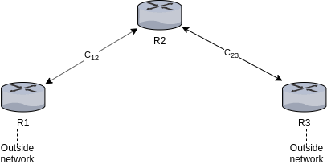

Name: Adika Bintang Sulaeman

---

## Assumptions



1. Each router knows the link capacity of the links connected to the router. For example, in the above network, R1 knows the link capacity C12, R2 and R3 know C23. The router obtains the link capacity by calling `getLinkCapacity(next_node)` function.

2. When listing the neighbor nodes N, router does not consider anything outside the pre-defined network.

# A. AppBandwidth()

At root, it returns a map/dictionary of `{protocol: percentage of aggregated bandwidth used}`. It lists all the protocols passing through the network.

```
// protocol: string
// sum_bwidth: float
// sum_link_cap: float

// tuple(elemnt1, element2) is accessed with 
// tuple[0] and tuple[1], like in python

// instatiate a tuple using (element1, element2, ...)

// map/dictionary is accessed with m[key], like in python

aggregator object AppBandwidth()
    // A map/dictionary of protocol and the tuple of total
    // bandwidth from table and the sum of link 
    // capacities traversed
    map<protocol, (sum_bwidth, sum_link_cap, agg_bandwidth)> local_m;

    procedure initiate()
        
        // read the table
        for row in table:
            link_capacity = getLinkCapacity(row["nextHop"]);
            protocol = row["protocol"]

            bw_sum = row["bandwidth"];
            cap_sum = link_capacity;
            if protocol in local_m:
                protocol_map = local_m[protocol];
                bw_sum = bw_sum + protocol_map[0];
                cap_sum = cap_sum + protocol_map[1];

            aggregated_bw_percent = (bw_sum / cap_sum) * 100;  
            
            local_m[protocol] = (bw_sum, cap_sum, aggregated_bw_percent);
    
    procedure value()
        return(local_m)
    
    procedure aggregate(mChild: 
        map<protocol, (sum_bwidth, sum_link_cap, agg_bandwidth)>)

        // combined the echoed map to the local map
        // iterating dictionary like in python
        for protocol, tuple_t in local_m:
            
            if protocol in mChild:
                // sum to local_m
                local_bw = tuple_t[0];
                local_cap = tuple_t[1];
                incoming_sum_bw = mChild[protocol][0];
                incoming_sum_cap = mChild[protocol][1];
                sum_bw = local_bw + incoming_sum_bw;
                sum_cap = local_cap+ incoming_sum_cap;
                aggregated_bw_percent = (sum_bw / sum_cap) * 100;

                local[protocol] = (sum_bw, sum_cap, aggregated_bw_percent)
            else:
                // append to local_m
                local_m[protocol] = item;
    
    procedure global():
        map<protocol, aggregated_bandwidth> result_map;
        
        // result map is the map of protocol and aggregated bandwidth
        for protocol, value in local_map:
            // value[2] is percentage of aggregated bandwidth
            result_map[key] = value[2];
        
        return result_map;
    
    procedure getLinkCapacity(nextHop)
        return the capacity link of this router to the next hop;
```

# B. LargeFlows(T)

```
aggregator object LargeFlows(T)
    allFlow = 0
    filteredFlow = 0
    
    procedure initiate()
        // read the table
        for row in table:
            allFlow = allFlow + 1;
            if row["bandwidth"] > T:
                filteredFlow = filteredFlow + 1;
        
    procedure aggregate([allFlowChild: int, filteredFlowChild]):
        allFlow = allFlow + allFlowChild;
        filteredFlow = filteredFlow + filteredFlowChild;

    procedure value()
        return ([allFlow, filteredFlow]);
    
    procedure global()
        return ((filteredFlow / allFlow) * 100);
```