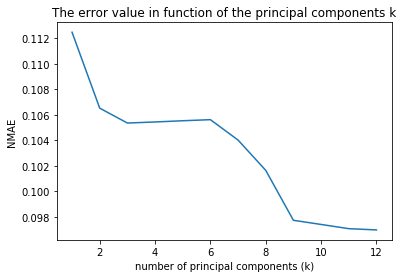
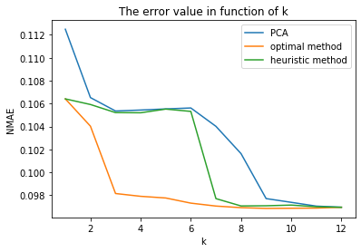
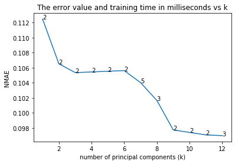
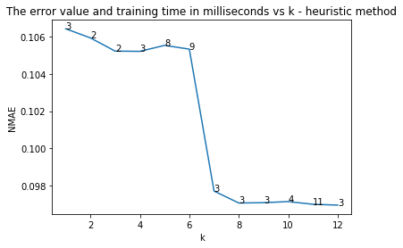
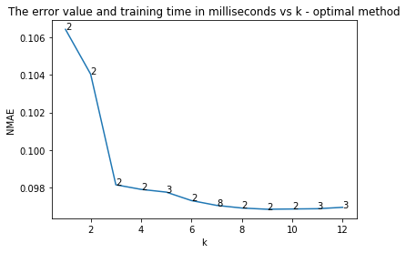

# Optional Task Report

The graph above shows the relationship between the number of principal components to the error of the model. In general, we can wee that the error values decline as the number of principal component increases. However, having more than 9 principal components does not reduce the error. Thus, nine principal components is a good number to build a good model.

Compared to the two other techniques, which are optimal and heuristic, the error of the model built by PCA tends to be larger, as shown on the graph above. However, when `k = [3, 6]`, the errors of PCA and heuristic method are roughly the same. In addition, when `k` is equal to or more than 9, the errors are roughly the same. We can say that for some values of `k`, PCA is on par with heuristic method.

The above three graphs show not only the error, but also the time taken to train the model in millisecond. The heuristic method selects features that takes longer time to train. PCA, does something different than selecting features. It reduces the dimension of the features. Therefore, although at some points of `k` PCA is less accurate, it makes the model faster to train.

Compared to the optimal method, PCA makes the model slightly faster to train. However, the accuracy difference is somewhat significant.

In conclusion, PCA is good if the time taken to train the model has higher priority than accuracy.