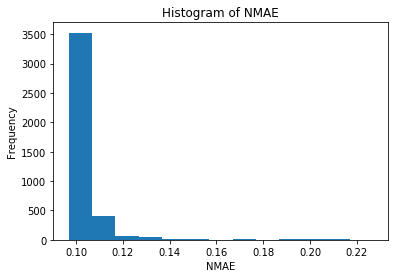
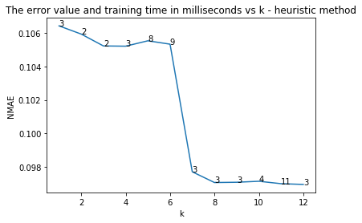
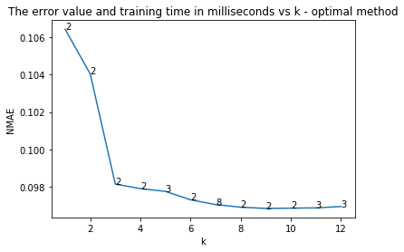

- Name: Adika Bintang Sulaeman
- Student ID: 19940715-­3239

---

# Report Task 1

## The mean (average), maximum, minimum, 25th percentile, 90th percentile, and standard deviation

The below data give the mean (average), maximum, minimum, 25th percentile, 90th percentile, and standard deviation of each feature of X and Y. Refer to the Jupyter Notebook file for how this is generated in Python.

```
---
Mean of each component of X:
runq-sz          70.73
%%memused        19.64
proc/s            7.52
cswch/s       53671.17
all_%%usr        86.30
ldavg-1          74.48
totsck          489.14
pgfree/s     129287.48
plist-sz        888.75
file-nr        2631.17
idel/s           37.27
tps               4.07
dtype: float64
Mean of each component of Y:
DispFrames    19.36
dtype: float64

---
Maximum value of each component of X:
runq-sz         154.00
%%memused        26.38
proc/s           53.00
cswch/s       82299.00
all_%%usr        98.25
ldavg-1         142.10
totsck          728.00
pgfree/s     210520.00
plist-sz       1376.00
file-nr        2928.00
idel/s          592.00
tps              54.00
dtype: float64
Maximum value of each component of Y:
DispFrames    27.61
dtype: float64

---
Mininmum value of each component of X:
runq-sz          0.00
%%memused       13.99
proc/s           0.00
cswch/s       6525.00
all_%%usr       13.84
ldavg-1          6.00
totsck         262.00
pgfree/s     17452.00
plist-sz       435.00
file-nr       2304.00
idel/s           1.00
tps              0.00
dtype: float64
Minimum value of each component of Y:
DispFrames    0.0
dtype: float64

---
25th percentile of each component of X:
runq-sz          26.00
%%memused        18.60
proc/s            0.00
cswch/s       30293.00
all_%%usr        78.08
ldavg-1          29.00
totsck          361.00
pgfree/s     117509.00
plist-sz        629.00
file-nr        2496.00
idel/s           16.00
tps               0.00
Name: 0.25, dtype: float64
25th percentile of each component of Y:
DispFrames    14.83
Name: 0.25, dtype: float64

---
90th percentile of each component of X:
runq-sz         123.00
%%memused        23.24
proc/s           19.00
cswch/s       72377.20
all_%%usr        97.71
ldavg-1         130.38
totsck          661.00
pgfree/s     160473.90
plist-sz       1240.00
file-nr        2832.00
idel/s           70.00
tps              16.00
Name: 0.9, dtype: float64
90th percentile of each component of Y:
DispFrames    24.0
Name: 0.9, dtype: float64

---
standard deviation of each component of X:
runq-sz         41.83
%%memused        2.44
proc/s           8.59
cswch/s      20714.81
all_%%usr       20.08
ldavg-1         43.86
totsck         131.48
pgfree/s     27255.11
plist-sz       265.77
file-nr        155.11
idel/s          41.83
tps              7.31
dtype: float64
standard deviation of each component of Y:
DispFrames    4.6
dtype: float64
```


## Conditional Computation

```
The number of observations with CPU util < 90%:  996
The number of observations with mem used < 50%:  3600
```

The above data shows the result of counting the row/observation based on conditions given. Refer to the Jupyter Notebook file for how this is generated in Python.

## Plotting

### Time series of memory usage ("%%memused") and CPU utilization ("all_%%usr")


The graph shows that before 14:10, the CPU utilization is very high, but the memory usage is small even though it shows a very little increase overtime. From 14:10 to 14:20, CPU utilization suddenly gets dropped but the memory usage is constantly increases. From these two plots, we can say that there is no direct relationship between memory usage and CPU utilization.

### Box plot of memory usage ("%%memused") and CPU utilization ("all %%usr")


This boxplot shows the average (in the red dot), maximum, minimum, as well as the standard deviation of the dataframe (in the white box). The first thing to notice is the average memory usage is much smaller than the average of CPU utilization. This means that the server runs programs which demand more computation power than memory allocation. Secondly, the CPU utilization has broader variance than that of memory usage, which means the fluctuation of CPU utilization is high.

### Density plots of memory usage ("%%memused") and CPU utilization ("all %%usr")


The above graph shows the density of the memory usage. Among all the data of memory usage, the highest probability of most frequent memory usage is around 20%, which takes around 30% of the density population. However, we can also see that the memory usage varies between around 13% to 28%.


The density plot above shows that most of the time, the server has probably almost 100% CPU load, which is around 70% of all the time. The CPU also has lower CPU utilization, from around 20% to 80%, but the server rarely has that low CPU utilization.

### Histograms of memory usage ("%%memused") and CPU utilization ("all %%usr")


The above histogram shows the actual frequency of memory usage data. Almost 1200 of 3600 observations shows 20% of memory usage. The range of variance is from aroud 14% to 26% of memory usage. This shows the server memory usage is normal and stable.


The above histogram shows the actual frequency of CPU utilization data. More than 1750 observations shows the server has overloaded CPU utilization (100%), and some much small number of lower CPU utilization. This shows that the server does heavy computation most of the time.

# Report Task 2

## Evaluate the Accuracy of Service Metric Estimation

### Model Training - linear regression to train a model M with the training set

The cofficients of the models are:

```
The coeffiecients of the models are:
w1 -> The coefficient for runq-sz: -0.033
w2 -> The coefficient for %%memused: 0.258
w3 -> The coefficient for proc/s: 0.002
w4 -> The coefficient for cswch/s: -0.0
w5 -> The coefficient for all_%%usr: 0.072
w6 -> The coefficient for ldavg-1: 0.013
w7 -> The coefficient for totsck: 0.001
w8 -> The coefficient for pgfree/s: -0.0
w9 -> The coefficient for plist-sz: -0.009
w10 -> The coefficient for file-nr: 0.003
w11 -> The coefficient for idel/s: 0.0
w12 -> The coefficient for tps: 0.002
The bias b: 16.498
```

### Accuracy of Model M

```
NMAE of the prediction model: 0.09684122
The naive estimator value or mean of y_test['DispFrames']: 19.392129634485986
NMAE of the naive prediction model: 0.21765562
```

The naive estimation value is defined as the average of the display frame rates in the test set, which the value is 19.62406481879705. This method predicts that the display rates is always 19.62406481879705 regardless the condition of the other variables from the server machine (in X set).

As the above data shows, the NMAE of the prediction model is 0.09671137 whereas the NMAE for the naive model is 0.21534818. This shows that the prediction model with linear regression is much more accurate than the naive prediction model because the NMAE of the linear regression is around 2.2 times smaller.

### A time series plot that shows both the measurements and the model estimations for M for the Video Frame Rate values in the test set


The graph above shows the actual display frames values in blue line, the prediction of the display frames values in red line, and the naively predicted frames which is basically the average of the display frames in the test set.

The pattern of the prediction plot resembles the actual plot. When the data is fluctuative such as from the time 13:30 to 14:00, the prediction is in the range of the fluctuation. Even from 14:10 to 14:20, when the variation of the display frames is small, the prediction plot is still roughly within the variation. Therefore, the prediction model is quite accurate in predicting the display frames values.

### A density plot and a histogram for the Video Frame Rate values in the test set


These histogram shows that most of the frame rates are between 12 and 25. The most rate that the data has is around 24 frames/second, which occupies more than 300 data.


The density plot shows the bimodal shape. The density plot shows that probably the most values is around 24. The second peak of the plot is at around 15 frames/second.

### a density plot for the prediction error 𝑦𝑖−𝑦̂ 𝑖 in the test set


This density plot shows that the highest probability density function given any value in X axis, which is the difference between the real value and the predicted value, is around 0.22. The plot shows a steep declines toward y-y'=10. After that, the probability density shows value around 0. This means that the model will probably falsely predict no more than 10 rates difference.

## Relation between Estimation Accuracy and size of training set


The above graph shows the relationship between the Normalized Mean Absolute Error (NMAE) to the number of observations in the tranining sets. The plot shows that the relationship between the number or observations in the training sets the the NMAE resembles the inverse logarithmic function graph. The larger the training set is, the smaller the NMAE will be. This inverse-logarithmic-like relationship shows that the NMAE will saturate at around 0.05. Therefore, even though it's better to have large training sets, when the training sets is larger than 1000, it will not give significant improvement.

# Report Task 3

## Model Training - use Logistic Regression to train a classifier C with the training set

The coefficients of the models are

```
1 The coefficient for runq-sz is -0.024
2 The coefficient for %%memused is 0.033
3 The coefficient for proc/s is 0.006
4 The coefficient for cswch/s is -0.0
5 The coefficient for all_%%usr is 0.004
6 The coefficient for ldavg-1 is -0.001
7 The coefficient for totsck is 0.009
8 The coefficient for pgfree/s is -0.0
9 The coefficient for plist-sz is -0.004
10 The coefficient for file-nr is 0.001
11 The coefficient for idel/s is -0.0
12 The coefficient for tps is -0.003
The intercept for our model is (teta 0) 0.0
```

## Accuracy of the Classifiers C

### The classification error (ERR) on the test set

```
ERR of logistic regression: 0.16759259259259263
```

This model, which is based on logistic regression, has classification error rate of 0.16759259259259263.

### Confusion matrix


#### Analysis of the confusion matrix

The confusion matrix summarizes how successful the model is in classifying the data.

The left-top element of the matrix has value 0 for both true label and predicted label. This is "true negative", i.e., the model successfully label the data as "false", and the real data is also "false".

The right-top element of the matrix has 0 on true label, but 1 on predicted label. This is "false positive", i.e., the model predicts the value as true, yet the real data says it is false.

The bottom-left element of the matrix has value 1 for the true label and 0 for predicted label. This is "false negative", i.e, the model predicts the value as false, yet the real data says it is true.

The bottom-right element of the matrix has value 1 for both true label and predicted label. This is "true positive", i.e., the model successfully predicts the value as true, and the real data is also true.

This confusion matrix shows that our logistic-based regression model can predict "false"/SLA violation correctly 418 times, and 122 times wrongly predict. It also shows that it is successfully predict "true"/passed SLA 481 times and 59 times has mistaken the prediction. These values (also the color; the darker the higher the value is) shows that the model is quite successful in predicting/classifying the data.

#### False Positive (FP) and False Negative (FN) comparison

False Positive (FP) happens when the model predicts a negative result whereas the real valid data shows positive data. False Negative (FN) happens when the model predicts a positive result whereas the real valid data shows negative data.

In this case, the Internet Service Provider (ISP) mostly cares about FN, because it is better to assume that the service violates the SLA whereas in reality it is not, than to assume the service complies the SLA but in reality it violates the SLA. In this way, the ISP prioritizes users satisfaction.

## Naı̈ve method

```
sla_conform in training set: 1397
all training set: 2520
p: 0.5543650793650794
ERR of naive classification: 0.010185185185185186
```

## Build a new classifier by extending the linear regression function developed in Task II with a check on the output, i.e., the Video Frame Rate

```
ERR of linear regression-based model: 0.15833333333333333
```

## The comparison of the classification errors of the models

We have three models and their classification error values:

- Logistic regression-based model's error: 0.16759
- Naive (y values-only) error: 0.010185
- Linear regression (and extended)-based model's error: 0.15833

The classification error describes how reliable the model is. The higher the error value is, the less reliable the model will be. If we sort the error in increasing order, the sequence is as follows: naive model, logistic regression-based model and linear regression-based model.

The regression models, both logistic and linear, takes x values into consideration. Most importantly, it tries to minimize the cost function when building the model (finding the coefficients) in order to be as precise as possible.

The naive model relies on Y value to build the model, i.e., the probability of the service to comply with the SLA. If the splitting of the training set and the test set is uniformly random, the probability of the service to comply the SLA in the training set and the test set is not significantly different. However, when the training set and the test set are not splitted with uniformly random, the probability will probably not go well. In addition, given a new x data, the reliability of the model to classify the new data is also less reliable than that of the regression-based models.

# Report Task 4

## Optimal Method

```
the smallest NMAE (0.09685993) is the model with features:
['runq-sz', '%%memused', 'cswch/s', 'all_%%usr', 'ldavg-1', 'pgfree/s', 'plist-sz', 'file-nr', 'tps']
```




The method which is used to find the features with the smallest error is building a subset of each features, building the linear regression model, then finding the smallest NMAE of all the models built. The features with the smallest error are 'runq-sz', '%%memused', 'cswch/s', 'all_%%usr', 'ldavg-1', 'pgfree/s', 'plist-sz', 'file-nr', 'tps'.

From the histogram, we can see the the highest number of error (NMAE) is around 0.1 with more than 3000 data. This means that the models mostly have 0.1 error with various features applied to the model.

The boxplot shows the relation between the number of features and the NMAE. The growth of the function resembles the inverse logarithmic function, with the NMAE seems to saturate when the number of features exceeds 4. 

We can also see that the variance of the error is very high if only one feature involved to build the model. If the number of features are more than four to build the model, the variances are small and roughly the same even though the number of features are added to 12.

## Heuristic method

```
Rank of the features according to the square of the correlation values:
plist-sz: 0.6376769572704232
totsck: 0.6348541962392853
runq-sz: 0.6277663322832961
ldavg-1: 0.6168571417878531
cswch/s: 0.5307997934869442
file-nr: 0.5221921171327957
all_%%usr: 0.3093290304770762
%%memused: 0.11959251450970435
idel/s: 0.08221690076956048
proc/s: 0.03640409968203089
pgfree/s: 0.00017554917649260075
tps: 5.284353085283944e-05
```


The correlation values calculated is within the range [-1, +1]. The rank of the correlation values presented is the square of the correlation values, which means all features ranked is positive values. By ranking the square of the correlation values, it is expected to see how each features contribute to the estimated values.

The abosulte correlation value indicates the strength of the relation ship, while the sign of the value shows the direction of the relationship [1].

The heuristic method also shows how many features we need to build such a reliable model in a heuristic way. If the number of features included in a model is less then 6, the NMAE is relatively high. If the number of features is more than 6, the NMAE is steeply reduced. We can say that 8 features is the good number of features to build a model, whereas if we give more than 8, it will not significantly improve the model. The method shows that we need 8 features at least to build a reliable model.

## Correlation matrix showing the correlation between variable


The correlation matrix visualizes the correlation coefficient between each features. The darker-colored cell shows the higher correlation coefficient. 

According to the correlation matrix, the strongest features are runq-sz, %%memused, proc/s, cswch/s, all_%%usr, ldavg-1. The seventh feature, totsck, shows significant difference in color then the sixth feature, ldavg-1. Moreover, the eight features, pgfree/s, shows a very contrast color to the preceeding features, which has the value of almost 0. 

This explains the decline of the error shown by graph of error value in function of the set size k generated with heuristic model. It also shows us that the strongest four features is enough to get a reliable model, as shown by the optimal method.

## Comparison of the optimal method with the heuristic method


The curves show the relationship between the number of features and the error values. For every model built with 1 to 12 features, the error of optimal method is smaller than those of heuristic method. This means that optimal method gives more precise model than the heuristic model, which is expected. Heuristic focuses more on reaching immediate goal yet not guaranteed to be optimal or perfect [2].

Another thing to see from the graph is when the model generates smaller errors. With the optimal method, even with only 4 features, it can build a model with smaller errors. In heuristic method, only models with more than 6 features has smaller error values.

The optimal method tries to find the most correlated features by brute forcing, creating different models with all combinations of all features. This is very exhausting task yet guaranteed to find the best model. On the other hand, heuristic model tries to calculate the correlation value and determine what features it will take based on the result of the correlation values calculation.

However, it is important to note that adding more than eight features does not bring less error. Considering that optimal takes much more time to compute, if the ISP decides to have eight features or more, heuristic method is preferable.

#### Conclusion

- The optimal method is slower, with the growth function of O(2^n), while heuristic method is faster, with the growth function of O(n)
- The optimal method is more accurate than the heuristic method to find the most correlated features to build the model
- If the number of features are relatively small, than optimal method can be used. If the number of features are high, then heuristic method is preferable. However, the trade-offs between accuracy and efficiency must be taken into account.

## References

[1] https://statisticsbyjim.com/basics/correlations/

[2] https://en.wikipedia.org/wiki/Heuristic

# Optional Task Report


The graph above shows the relationship between the number of principal components to the error of the model. In general, we can wee that the error values decline as the number of principal component increases. However, having more than 9 principal components does not reduce the error. Thus, nine principal components is a good number to build a good model.


Compared to the two other techniques, which are optimal and heuristic, the error of the model built by PCA tends to be larger, as shown on the graph above. However, when `k = [3, 6]`, the errors of PCA and heuristic method are roughly the same. In addition, when `k` is equal to or more than 9, the errors are roughly the same. We can say that for some values of `k`, PCA is on par with heuristic method.






The above three graphs show not only the error, but also the time taken to train the model in millisecond. The heuristic method selects features that takes longer time to train. PCA, does something different than selecting features. It reduces the dimension of the features. Therefore, although at some points of `k` PCA is less accurate, it makes the model faster to train.

Compared to the optimal method, PCA makes the model slightly faster to train. However, the accuracy difference is somewhat significant.

In conclusion, PCA is good if the time taken to train the model has higher priority than accuracy.