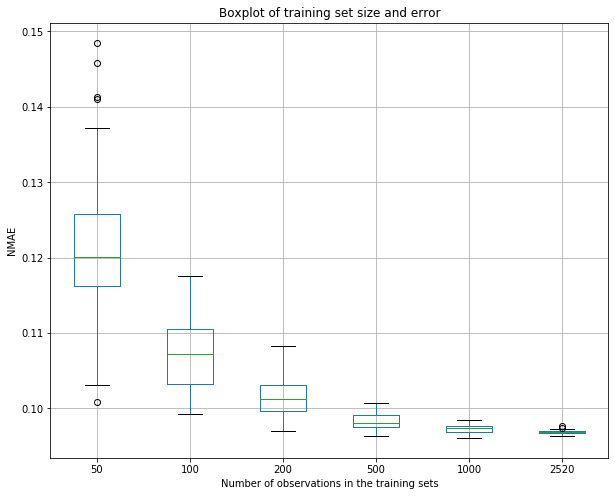

Oversimplified supervised learning for network/infrastructure guys

# Part 1: How to read some basic plots

## How to read box plot and density plot

### Boxplot

- How to read boxplot [[towardsdatascience](https://towardsdatascience.com/understanding-boxplots-5e2df7bcbd51#targetText=A%20boxplot%20is%20a%20standardized,and%20what%20their%20values%20are.)]


Image source: Michael Galarnyk on [towardsdatascience](https://towardsdatascience.com/understanding-boxplots-5e2df7bcbd51#targetText=A%20boxplot%20is%20a%20standardized,and%20what%20their%20values%20are.)

Boxplot shows:
- Median (Q2)
- Q1
- Q3
- The box is actually interquartile range (IQR) = `Q3 - Q1`
- Minimum (`Q1 - 1.5 * IQR`)
- Maximum (`Q1 + 1.5 * IQR`)
- Outliers: data that is very different from the others [[wikipedia](https://en.wikipedia.org/wiki/Outlier#targetText=In%20statistics%2C%20an%20outlier%20is,serious%20problems%20in%20statistical%20analyses.)]

### Density plot

What is density plot: [towardsdatascience.com](https://towardsdatascience.com/histograms-and-density-plots-in-python-f6bda88f5ac0).

- x values: like those of histogram
- y values: hmmm...

Some hints for y:
- The _area_ under the curve represents the probability of getting an x value between a range of x values [[stackexchange](https://stats.stackexchange.com/questions/48109/what-does-the-y-axis-in-a-kernel-density-plot-mean)]
- Watch this if the first point does not make sense: [[khanacademy](https://www.khanacademy.org/math/statistics-probability/random-variables-stats-library/random-variables-continuous/v/probability-density-functions)]
- Another article: [[towardsdatascience](https://towardsdatascience.com/how-to-find-probability-from-probability-density-plots-7c392b218bab)]

## Supervised vs unsupervised learning

In a nutshell:
- Supervised learning: there is label/result on the training data.
- Unsupervised learning: there is no label/result on the training data.

In other words:
- Supervised learning: \\( \{(X_t, Y_t)\} \longrightarrow M : X \rightarrow \hat y \\)
- Unsupervised learning: \\( \{X_t\} \longrightarrow M_\theta(X) \\)

## Building a model with validation-set approach

Given a dataset of `n` observations, model `M` **learns** from the _training set_, and it is **evaluated** with the _test set_. The sum of the number of observations in the training set and the test set is equal to `n`.

The training set and the test set should be picked uniformly random from the dataset. Usually, the training set size is larger than that of the test size.

```python
import pandas as pd
from sklearn.model_selection import train_test_split

X = pd.read_csv('data/X.csv')
Y = pd.read_csv('data/Y.csv')

# set the training size to 70% of the dataset, 
# and test size of 30% of the dataset
X_train, X_test, y_train, y_test = train_test_split(x, 
    y, training_size=0.7)
```

### Evaluation metric: Mean Squarred Error (MSE)

$$MSE = {1 \over m}\sum_{i=1}^m || y^{(i)} - M(x^{(i)}) || ^ 2$$

\\(m\\) = number of observations.

This is also called **cost function** \\( J(\theta_0, \theta_1, ..., \theta_n) \\).

# Part 2: Linear Regression

## What is linear regression?

A good video to watch: [[Andrew Ng](https://www.youtube.com/watch?v=Q4GNLhRtZNc&list=PLLssT5z_DsK-h9vYZkQkYNWcItqhlRJLN&index=19&t=0s)].

The terms we are going to use:
- `x` is the feature/input of the model. It can be 1 or more.
- `y` is the result of the model computation.

For example, in a dataset from a web server observation, we can have:
- \\( x_1 \\): CPU percentage at a particular time
- \\( x_2 \\): memory usage at a particular time
- \\( x_3 \\): [iowait](https://serverfault.com/questions/12679/can-anyone-explain-precisely-what-iowait-is) at a particular time
- \\( y \\): web server response time in millisecond

By the way, the \\( x \\) in the above example can be obtained from `sar` command in Linux.

In a nutshell, based on the data in the training set, we want to build a linear equation so that we can calculate/predict the new value of \\( y \\) given only \\( x \\).

So, in our example, the linear regression model is:

$$ \hat y = M_\theta = \theta_0 x_0 + \theta_1 x_1 + \theta_2 x_2 + \theta_3 x_3 = \theta^\mathsf{T}x$$

\\( x_0 \\) is 1, \\( \theta_0 \\) is called offset (offset -> the \\( y \\) value when \\( x=0 \\)). The \\( \theta^\mathsf{T}x \\) is a matrix multiplication of \\( \theta^\mathsf{T} \\) (transponse of matrix \\( \theta \\), a 3x1 column matrix) with matrix \\( x \\) (a 1x3 column matrix).

Least square regression tries to find model coefficients \\( \theta_0, \theta_1, ..., \theta_n \\) so that the MSE is as small as possible.

To minimize the error when choosing coefficients \\( \theta \\), the steps are [[Andrew Ng](https://www.youtube.com/watch?v=F6GSRDoB-Cg&list=PLLssT5z_DsK-h9vYZkQkYNWcItqhlRJLN&index=8)]:
- Start with some \\( \theta_0, \theta_1, ..., \theta_n \\) (usually they are initially set with 0)
- Keep changing the coefficient \\( \theta \\) to reduce the cost function \\( J(\theta) \\) until _hopefully_ end up at a minimum. This is done with _gradient descent algorihtm_.

Gradient descent algorithm:

$$ repeat\ until\ convergence\ \{
    \theta_j := \theta_j - \alpha {\partial \over \partial \theta_j} J(\theta_0, \theta_1, ..., \theta_n) 
    \}\ for (j = 0\ to\ j = n) 
    $$

With \\( \alpha \\) is the learning rate and \\( {\partial \over \partial \theta_j} J(\theta_0, \theta_1, ..., \theta_n) \\) is the derivative term.

### How to build a linear regression in Python using Scikit-Learn

```python
from sklearn.linear_model import LinearRegression
from sklearn import metrics

regression_model = LinearRegression()
regression_model.fit(X_train, y_train)
y_predict = regression_model.predict(X_test)

# print the coefficient
print(regression_model.coef_)

# print the intercept
print(regression_model.intercept_)

# print the MSE
print(metrics.mean_squared_error(y_test, y_predict))
```

# Part 3: Classification - Logistic Regression

## What is logistic regression?

Explanation: [[Andrew Ng](https://www.youtube.com/watch?v=t1IT5hZfS48&list=PLLssT5z_DsK-h9vYZkQkYNWcItqhlRJLN&index=33)]

Logistic regression is used for classification. For example, it can be used to classify whether an email is a spam or not.

The model of the logistic regression is:

$$M_\theta(x) = \sigma(\theta^\mathsf{T}x)$$

Whereby

$$\sigma(z) = {1 \over {1 + e ^ {-z}}}$$

Notice that \\( \theta ^ \mathsf{T}x \\) is the same as that in the linear regression.

\\( \sigma(z) : \real \rightarrow (0, 1) \\) is the [sigmoid/logistic function](https://en.wikipedia.org/wiki/Sigmoid_function).

The interpretation of \\( M_\theta(x) \\) is the **estimated probability that \\( y=1 \\) on input x** [[Andrew Ng](https://youtu.be/t1IT5hZfS48?list=PLLssT5z_DsK-h9vYZkQkYNWcItqhlRJLN&t=200)].

### Logistic regression in Python using Scikit-Learn

```python
from sklearn.linear_model import LogisticRegression

logistic_regr = LogisticRegression(C=1e5, solver='lbfgs', 
    multi_class='multinomial')

logistic_regr.fit(X_train, y_train)
prediction_result = logistic_regr.predict(X_test)
```

## Classification: True vs. False and Positive vs. Negative

A very good explanation for true-false-positive-negative: [[developers.google.com](https://developers.google.com/machine-learning/crash-course/classification/true-false-positive-negative)]

In a nutshell:

- True positive (_**correctly** says something is true_)
  - Reality: true
  - System says: true 
- True negative (_**correcly** says something is wrong_)
  - Reality: false
  - System says: false
- False positive (_**incorrectly** says something is true, but it is actually false_)
  - Reality: false
  - System says: true
- False negative (_**incorrectly** says something is false, but it is actually true_)
  - Reality: true
  - System says: false

### Confusion Matrix

See [[developers.google.com](https://developers.google.com/machine-learning/crash-course/classification/true-false-positive-negative)].

## The relationship between the estimation error and training size



The above graph shows the relationship between the number of observations in the training set vs the error produced by the model built. Important things to see:
- The average of the error decreases exponentially with the number of features in the training sets, and it eventually converges. It means that the larger the training set we have, the better, until it converges and adding more features will not give significant improvement.
- The variance of the error also decreases as the training set size grows.

# Part 4: Reducing the features (X values)

What if the number of features (\\( x \\)) is so large that it will take so long to compute, send the raw data, and hard to save on the drive?

We might want to exclude some features in the training and test size. One of the ways to do it is ask the expert of the field which features really matter. For example, in the dataset from the web server operation, we can ask the infrastructure guys which metrics that can affect the performance of the server. However, if the data is too large and no one knows for sure which features matter, we can reduce the features using the following techniques.

## Optimal Method: Build all subsets of the feature set X

From the `n` number of fetures, build models from the subset of all features, then choose the features which yields the smallest error. This exhaustive search has the complexity of \\( O(2^n) \\).

```python
import itertools

def subs(l):
    res = []
    for i in range(1, len(l) + 1):
        for combo in itertools.combinations(l, i):
            res.append(list(combo))

feature_names = [
    "cpu_percentage", 
    "memory_usage", 
    "iowait"
    ]

all_subset = subs(feature_names)
```

## Heuristic Method: Linear univariate feature selection

Basic idea: choosing the features based on the correlation values of the feature. The correlation value falls into the interval \\( [-1, +1] \\)

```python
# "target" is the feature of the result y
corr_values = my_data.corr()["target"]
print(corr_values)

abs_corr_values = abs(corr_values)
print(abs_corr_values)
```

How to read the correlation values [[statisticsbyjim](https://statisticsbyjim.com/basics/correlations/)]:
- The absolute correlation value determines the strenth; the closer the absolute value to 1, the stronger it is to the \\( y \\)
- The sign (negative or positive) represents the direction of the relationship.

## Principal Component Analysis (PCA)

PCA explanation: [[georgemdallas](https://georgemdallas.wordpress.com/2013/10/30/principal-component-analysis-4-dummies-eigenvectors-eigenvalues-and-dimension-reduction/#targetText=First%20of%20all%20Principal%20Component,on%20a%20normal%20x%2Dy%20axis.)]

How to use this in Python: [[towardsdatascience](https://towardsdatascience.com/pca-using-python-scikit-learn-e653f8989e60#targetText=It%20means%20that%20scikit%2Dlearn,of%20the%20variance%20is%20retained.&targetText=Fit%20PCA%20on%20training%20set.)]


---

"PCA is a technique used to emphasize variation and bring out strong pattern in a dataset" - [setosa.io](http://setosa.io/ev/principal-component-analysis/)

Steps:

- Normalization/standardization

When we have features with different unit of data (for example, cm for height and kg for weight in a human-something dataset), one data change can lead to be wrongly considered as more important than the other. Normalizing with z-score can help re-scalind the data. [[scikit-learn](https://scikit-learn.org/stable/auto_examples/preprocessing/plot_scaling_importance.html#sphx-glr-auto-examples-preprocessing-plot-scaling-importance-py)] [[codeacademy](https://www.codecademy.com/articles/normalization#targetText=Using%20z%2Dscore%20normalization%2C%20the,from%20about%20%2D2%20to%202.)]

- Find eigenvector and eigenvalue to find the principal components (and the variance is in the variable `pca.explained_variance_ratio_`)
- Reduce the dimensions (for example, if the variance of the component A is `n%` and B is `m%`, `m+n` is the sum of the variance and we can pick the number of components absed on the desired variance value).

## When to use the optimal, heuristic, or PCA?

...
