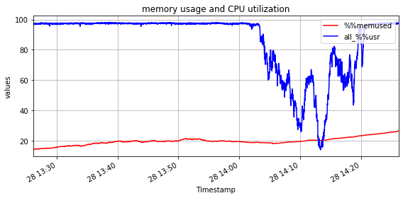
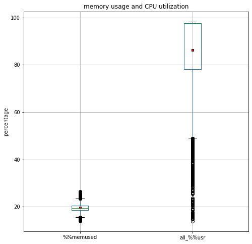
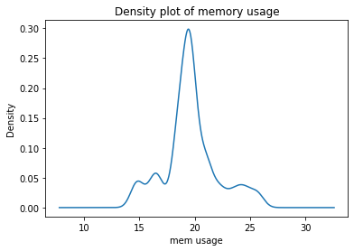
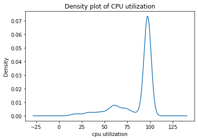
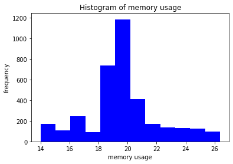
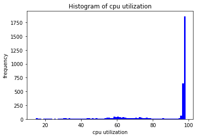

# Report Task 1

## The mean (average), maximum, minimum, 25th percentile, 90th percentile, and standard deviation

The below data give the mean (average), maximum, minimum, 25th percentile, 90th percentile, and standard deviation of each feature of X and Y. Refer to the Jupyter Notebook file for how this is generated in Python.

```
---
Mean of each component of X:
runq-sz          70.73
%%memused        19.64
proc/s            7.52
cswch/s       53671.17
all_%%usr        86.30
ldavg-1          74.48
totsck          489.14
pgfree/s     129287.48
plist-sz        888.75
file-nr        2631.17
idel/s           37.27
tps               4.07
dtype: float64
Mean of each component of Y:
DispFrames    19.36
dtype: float64

---
Maximum value of each component of X:
runq-sz         154.00
%%memused        26.38
proc/s           53.00
cswch/s       82299.00
all_%%usr        98.25
ldavg-1         142.10
totsck          728.00
pgfree/s     210520.00
plist-sz       1376.00
file-nr        2928.00
idel/s          592.00
tps              54.00
dtype: float64
Maximum value of each component of Y:
DispFrames    27.61
dtype: float64

---
Mininmum value of each component of X:
runq-sz          0.00
%%memused       13.99
proc/s           0.00
cswch/s       6525.00
all_%%usr       13.84
ldavg-1          6.00
totsck         262.00
pgfree/s     17452.00
plist-sz       435.00
file-nr       2304.00
idel/s           1.00
tps              0.00
dtype: float64
Minimum value of each component of Y:
DispFrames    0.0
dtype: float64

---
25th percentile of each component of X:
runq-sz          26.00
%%memused        18.60
proc/s            0.00
cswch/s       30293.00
all_%%usr        78.08
ldavg-1          29.00
totsck          361.00
pgfree/s     117509.00
plist-sz        629.00
file-nr        2496.00
idel/s           16.00
tps               0.00
Name: 0.25, dtype: float64
25th percentile of each component of Y:
DispFrames    14.83
Name: 0.25, dtype: float64

---
90th percentile of each component of X:
runq-sz         123.00
%%memused        23.24
proc/s           19.00
cswch/s       72377.20
all_%%usr        97.71
ldavg-1         130.38
totsck          661.00
pgfree/s     160473.90
plist-sz       1240.00
file-nr        2832.00
idel/s           70.00
tps              16.00
Name: 0.9, dtype: float64
90th percentile of each component of Y:
DispFrames    24.0
Name: 0.9, dtype: float64

---
standard deviation of each component of X:
runq-sz         41.83
%%memused        2.44
proc/s           8.59
cswch/s      20714.81
all_%%usr       20.08
ldavg-1         43.86
totsck         131.48
pgfree/s     27255.11
plist-sz       265.77
file-nr        155.11
idel/s          41.83
tps              7.31
dtype: float64
standard deviation of each component of Y:
DispFrames    4.6
dtype: float64
```


## Conditional Computation

```
The number of observations with CPU util < 90%:  996
The number of observations with mem used < 50%:  3600
```

The above data shows the result of counting the row/observation based on conditions given. Refer to the Jupyter Notebook file for how this is generated in Python.

## Plotting

### Time series of memory usage ("%%memused") and CPU utilization ("all_%%usr")



The graph shows that before 14:10, the CPU utilization is very high, but the memory usage is small even though it shows a very little increase overtime. From 14:10 to 14:20, CPU utilization suddenly gets dropped but the memory usage is constantly increases. From these two plots, we can say that there is no direct relationship between memory usage and CPU utilization.

### Box plot of memory usage ("%%memused") and CPU utilization ("all %%usr")



This boxplot shows the average (in the red dot), maximum, minimum, as well as the standard deviation of the dataframe (in the white box). The first thing to notice is the average memory usage is much smaller than the average of CPU utilization. This means that the server runs programs which demand more computation power than memory allocation. Secondly, the CPU utilization has broader variance than that of memory usage, which means the fluctuation of CPU utilization is high.

### Density plots of memory usage ("%%memused") and CPU utilization ("all %%usr")



The above graph shows the density of the memory usage. Among all the data of memory usage, the highest probability of most frequent memory usage is around 20%, which takes around 30% of the density population. However, we can also see that the memory usage varies between around 13% to 28%.



The density plot above shows that most of the time, the server has probably almost 100% CPU load, which is around 70% of all the time. The CPU also has lower CPU utilization, from around 20% to 80%, but the server rarely has that low CPU utilization.

### Histograms of memory usage ("%%memused") and CPU utilization ("all %%usr")



The above histogram shows the actual frequency of memory usage data. Almost 1200 of 3600 observations shows 20% of memory usage. The range of variance is from aroud 14% to 26% of memory usage. This shows the server memory usage is normal and stable.



The above histogram shows the actual frequency of CPU utilization data. More than 1750 observations shows the server has overloaded CPU utilization (100%), and some much small number of lower CPU utilization. This shows that the server does heavy computation most of the time.