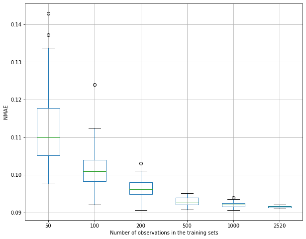

- Name: Adika Bintang Sulaeman
- Student ID: 19940715­-3239 

# The Evaluation of The Accuracy of Service Metric Estimation

The graph above shows the actual display frames values in blue line, the prediction of the display frames values in red line, and the naively predicted frames which is basically the average of the display frames in the test set.

The pattern of the prediction plot resembles the actual plot. When the data is fluctuative such as from the time 13:30 to 14:00, the prediction is in the range of the fluctuation. Even from 14:10 to 14:20, when the variation of the display frames is small, the prediction plot is still roughly within the variation. Therefore, the prediction model is quite accurate in predicting the display frames values.

This graph shows the difference between the actual value (`y`) and the prediction value (`y'`), which is `y-y'`. It is roughly seen that when the actual data variation is high, which is at 13:30 to 14:00, the error is quite high - up to 11 frames different. However, when the actual value is quite stable, such as at 14:10 to 14:20, the error rate is smalle - not more than 3 frames different. Hence, the prediction model is quite robust when the variation of the actual value is small.

# The Relationship between Estimation Error and the Size of the Training Set

The above graph shows the relationship between the Normalized Mean Absolute Error (NMAE) to the number of observations in the tranining sets. From the plot, the relationship is clear: the larger the training set is, the smaller the error will be.