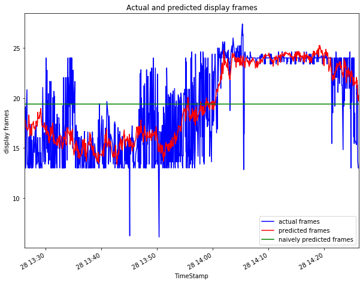
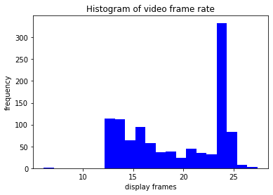
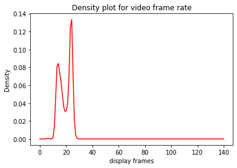
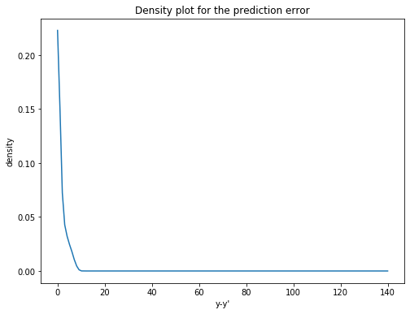

# Report Task 2

## Evaluate the Accuracy of Service Metric Estimation

### Model Training - linear regression to train a model M with the training set

The cofficients of the models are:

```
The coeffiecients of the models are:
w1 -> The coefficient for runq-sz: -0.033
w2 -> The coefficient for %%memused: 0.258
w3 -> The coefficient for proc/s: 0.002
w4 -> The coefficient for cswch/s: -0.0
w5 -> The coefficient for all_%%usr: 0.072
w6 -> The coefficient for ldavg-1: 0.013
w7 -> The coefficient for totsck: 0.001
w8 -> The coefficient for pgfree/s: -0.0
w9 -> The coefficient for plist-sz: -0.009
w10 -> The coefficient for file-nr: 0.003
w11 -> The coefficient for idel/s: 0.0
w12 -> The coefficient for tps: 0.002
The bias b: 16.498
```

### Accuracy of Model M

```
NMAE of the prediction model: 0.09684122
The naive estimator value or mean of y_test['DispFrames']: 19.392129634485986
NMAE of the naive prediction model: 0.21765562
```

The naive estimation value is defined as the average of the display frame rates in the test set, which the value is 19.62406481879705. This method predicts that the display rates is always 19.62406481879705 regardless the condition of the other variables from the server machine (in X set).

As the above data shows, the NMAE of the prediction model is 0.09671137 whereas the NMAE for the naive model is 0.21534818. This shows that the prediction model with linear regression is much more accurate than the naive prediction model because the NMAE of the linear regression is around 2.2 times smaller.

### A time series plot that shows both the measurements and the model estimations for M for the Video Frame Rate values in the test set



The graph above shows the actual display frames values in blue line, the prediction of the display frames values in red line, and the naively predicted frames which is basically the average of the display frames in the test set.

The pattern of the prediction plot resembles the actual plot. When the data is fluctuative such as from the time 13:30 to 14:00, the prediction is in the range of the fluctuation. Even from 14:10 to 14:20, when the variation of the display frames is small, the prediction plot is still roughly within the variation. Therefore, the prediction model is quite accurate in predicting the display frames values.

### A density plot and a histogram for the Video Frame Rate values in the test set



These histogram shows that most of the frame rates are between 12 and 25. The most rate that the data has is around 24 frames/second, which occupies more than 300 data.



The density plot shows the bimodal shape. The density plot shows that probably the most values is around 24. The second peak of the plot is at around 15 frames/second.

### a density plot for the prediction error 𝑦𝑖−𝑦̂ 𝑖 in the test set



This density plot shows that the highest probability density function given any value in X axis, which is the difference between the real value and the predicted value, is around 0.22. The plot shows a steep declines toward y-y'=10. After that, the probability density shows value around 0. This means that the model will probably falsely predict no more than 10 rates difference.

## Relation between Estimation Accuracy and size of training set


The above graph shows the relationship between the Normalized Mean Absolute Error (NMAE) to the number of observations in the tranining sets. The plot shows that the relationship between the number or observations in the training sets the the NMAE resembles the inverse logarithmic function graph. The larger the training set is, the smaller the NMAE will be. This inverse-logarithmic-like relationship shows that the NMAE will saturate at around 0.05. Therefore, even though it's better to have large training sets, when the training sets is larger than 1000, it will not give significant improvement.