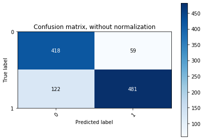

# Report Task 3

## Model Training - use Logistic Regression to train a classifier C with the training set

The coefficients of the models are

```
1 The coefficient for runq-sz is -0.024
2 The coefficient for %%memused is 0.033
3 The coefficient for proc/s is 0.006
4 The coefficient for cswch/s is -0.0
5 The coefficient for all_%%usr is 0.004
6 The coefficient for ldavg-1 is -0.001
7 The coefficient for totsck is 0.009
8 The coefficient for pgfree/s is -0.0
9 The coefficient for plist-sz is -0.004
10 The coefficient for file-nr is 0.001
11 The coefficient for idel/s is -0.0
12 The coefficient for tps is -0.003
The intercept for our model is (teta 0) 0.0
```

## Accuracy of the Classifiers C

### The classification error (ERR) on the test set

```
ERR of logistic regression: 0.16759259259259263
```

This model, which is based on logistic regression, has classification error rate of 0.16759259259259263.

### Confusion matrix



#### Analysis of the confusion matrix

The confusion matrix summarizes how successful the model is in classifying the data.

The left-top element of the matrix has value 0 for both true label and predicted label. This is "true negative", i.e., the model successfully label the data as "false", and the real data is also "false".

The right-top element of the matrix has 0 on true label, but 1 on predicted label. This is "false positive", i.e., the model predicts the value as true, yet the real data says it is false.

The bottom-left element of the matrix has value 1 for the true label and 0 for predicted label. This is "false negative", i.e, the model predicts the value as false, yet the real data says it is true.

The bottom-right element of the matrix has value 1 for both true label and predicted label. This is "true positive", i.e., the model successfully predicts the value as true, and the real data is also true.

This confusion matrix shows that our logistic-based regression model can predict "false"/SLA violation correctly 418 times, and 122 times wrongly predict. It also shows that it is successfully predict "true"/passed SLA 481 times and 59 times has mistaken the prediction. These values (also the color; the darker the higher the value is) shows that the model is quite successful in predicting/classifying the data.

#### False Positive (FP) and False Negative (FN) comparison

False Positive (FP) happens when the model predicts a negative result whereas the real valid data shows positive data. False Negative (FN) happens when the model predicts a positive result whereas the real valid data shows negative data.

In this case, the Internet Service Provider (ISP) mostly cares about FN, because it is better to assume that the service violates the SLA whereas in reality it is not, than to assume the service complies the SLA but in reality it violates the SLA. In this way, the ISP prioritizes users satisfaction.

## Naı̈ve method

```
sla_conform in training set: 1397
all training set: 2520
p: 0.5543650793650794
ERR of naive classification: 0.010185185185185186
```

## Build a new classifier by extending the linear regression function developed in Task II with a check on the output, i.e., the Video Frame Rate

```
ERR of linear regression-based model: 0.15833333333333333
```

## The comparison of the classification errors of the models

We have three models and their classification error values:

- Logistic regression-based model's error: 0.16759
- Naive (y values-only) error: 0.010185
- Linear regression (and extended)-based model's error: 0.15833

The classification error describes how reliable the model is. The higher the error value is, the less reliable the model will be. If we sort the error in increasing order, the sequence is as follows: naive model, logistic regression-based model and linear regression-based model.

The regression models, both logistic and linear, takes x values into consideration. Most importantly, it tries to minimize the cost function when building the model (finding the coefficients) in order to be as precise as possible.

The naive model relies on Y value to build the model, i.e., the probability of the service to comply with the SLA. If the splitting of the training set and the test set is uniformly random, the probability of the service to comply the SLA in the training set and the test set is not significantly different. However, when the training set and the test set are not splitted with uniformly random, the probability will probably not go well. In addition, given a new x data, the reliability of the model to classify the new data is also less reliable than that of the regression-based models.