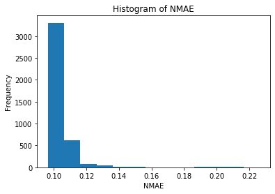
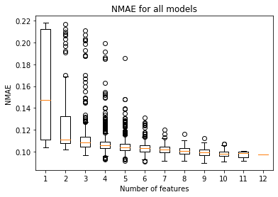
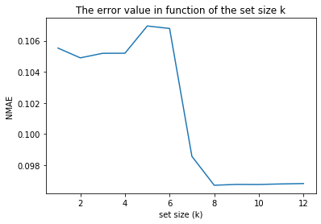
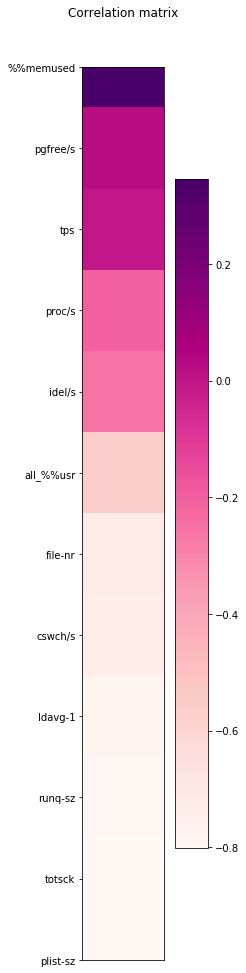
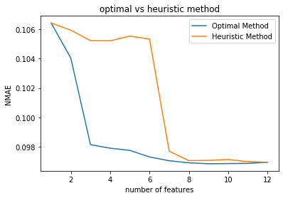

# Report Task 4

## Optimal Method

```
the smallest NMAE (0.09685993) is the model with features:
['runq-sz', '%%memused', 'cswch/s', 'all_%%usr', 'ldavg-1', 'pgfree/s', 'plist-sz', 'file-nr', 'tps']
```





The method which is used to find the features with the smallest error is building a subset of each features, building the linear regression model, then finding the smallest NMAE of all the models built. The features with the smallest error are 'runq-sz', '%%memused', 'cswch/s', 'all_%%usr', 'ldavg-1', 'pgfree/s', 'plist-sz', 'file-nr', 'tps'.

From the histogram, we can see the the highest number of error (NMAE) is around 0.1 with more than 3000 data. This means that the models mostly have 0.1 error with various features applied to the model.

The boxplot shows the relation between the number of features and the NMAE. The growth of the function resembles the inverse logarithmic function, with the NMAE seems to saturate when the number of features exceeds 4. 

We can also see that the variance of the error is very high if only one feature involved to build the model. If the number of features are more than four to build the model, the variances are small and roughly the same even though the number of features are added to 12.

## Heuristic method

```
Rank of the features according to the square of the correlation values:
plist-sz: 0.6376769572704232
totsck: 0.6348541962392853
runq-sz: 0.6277663322832961
ldavg-1: 0.6168571417878531
cswch/s: 0.5307997934869442
file-nr: 0.5221921171327957
all_%%usr: 0.3093290304770762
%%memused: 0.11959251450970435
idel/s: 0.08221690076956048
proc/s: 0.03640409968203089
pgfree/s: 0.00017554917649260075
tps: 5.284353085283944e-05
```



The correlation values calculated is within the range [-1, +1]. The rank of the correlation values presented is the square of the correlation values, which means all features ranked is positive values. By ranking the square of the correlation values, it is expected to see how each features contribute to the estimated values.

The abosulte correlation value indicates the strength of the relation ship, while the sign of the value shows the direction of the relationship [1].

The heuristic method also shows how many features we need to build such a reliable model in a heuristic way. If the number of features included in a model is less then 6, the NMAE is relatively high. If the number of features is more than 6, the NMAE is steeply reduced. We can say that 8 features is the good number of features to build a model, whereas if we give more than 8, it will not significantly improve the model. The method shows that we need 8 features at least to build a reliable model.

## Correlation matrix showing the correlation between variable



The correlation matrix visualizes the correlation coefficient between each features. The darker-colored cell shows the higher correlation coefficient. 

According to the correlation matrix, the strongest features are runq-sz, %%memused, proc/s, cswch/s, all_%%usr, ldavg-1. The seventh feature, totsck, shows significant difference in color then the sixth feature, ldavg-1. Moreover, the eight features, pgfree/s, shows a very contrast color to the preceeding features, which has the value of almost 0. 

This explains the decline of the error shown by graph of error value in function of the set size k generated with heuristic model. It also shows us that the strongest four features is enough to get a reliable model, as shown by the optimal method.

## Comparison of the optimal method with the heuristic method



The curves show the relationship between the number of features and the error values. For every model built with 1 to 12 features, the error of optimal method is smaller than those of heuristic method. This means that optimal method gives more precise model than the heuristic model, which is expected. Heuristic focuses more on reaching immediate goal yet not guaranteed to be optimal or perfect [2].

Another thing to see from the graph is when the model generates smaller errors. With the optimal method, even with only 4 features, it can build a model with smaller errors. In heuristic method, only models with more than 6 features has smaller error values.

The optimal method tries to find the most correlated features by brute forcing, creating different models with all combinations of all features. This is very exhausting task yet guaranteed to find the best model. On the other hand, heuristic model tries to calculate the correlation value and determine what features it will take based on the result of the correlation values calculation.

However, it is important to note that adding more than eight features does not bring less error. Considering that optimal takes much more time to compute, if the ISP decides to have eight features or more, heuristic method is preferable.

#### Conclusion

- The optimal method is slower, with the growth function of O(2^n), while heuristic method is faster, with the growth function of O(n)
- The optimal method is more accurate than the heuristic method to find the most correlated features to build the model
- If the number of features are relatively small, than optimal method can be used. If the number of features are high, then heuristic method is preferable. However, the trade-offs between accuracy and efficiency must be taken into account.

## References

[1] https://statisticsbyjim.com/basics/correlations/

[2] https://en.wikipedia.org/wiki/Heuristic